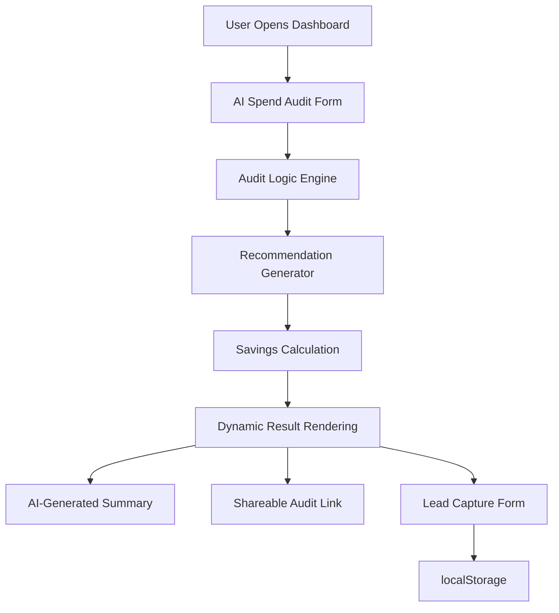

# Architecture

## System Diagram

## Data Flow

1. User fills the audit form — selects AI tool, plan, monthly spend, team size, use case
2. On submit, JavaScript reads all tool entries from the DOM
3. Each entry passes through the audit engine — a set of deterministic if/else rules that evaluate plan fit, team size match, and use case alignment
4. Savings are calculated per tool and summed
5. A personalized summary paragraph is generated from the results using a templated function
6. Results render on screen — per-tool breakdown, total savings hero, CTA based on savings tier
7. User can share a generated link or submit their email via the lead capture form
8. Form state and lead data are persisted to localStorage

## Current Stack

Frontend:

- HTML, CSS, vanilla JavaScript
- Chart.js for spending analytics visualization

Persistence:

- localStorage for form state and lead data

Deployment:

- Vercel (static site, zero config)

Version Control:

- Git, GitHub

## Why This Stack

Vanilla HTML/CSS/JS was chosen deliberately for three reasons:

1. **Zero build tooling** — no webpack, no npm scripts, no framework setup. This meant shipping the audit form and engine on Day 1 instead of Day 3.
2. **Fully static deployment** — Vercel deploys in under 30 seconds with no configuration. No serverless functions, no environment setup.
3. **Audit logic is deterministic** — the core value of this tool is defensible financial reasoning, not UI complexity. A framework would have added overhead without meaningful benefit at this scope.

The trade-off is that localStorage is not a real backend. Lead data does not persist across devices or browsers. This is the biggest architectural limitation of the current build.

## What I Would Change for 10,000 Audits/Day

| Current                | At Scale                                                  |
| ---------------------- | --------------------------------------------------------- |
| localStorage for leads | Supabase or Postgres — leads stored server-side           |
| Fake share URLs        | Real UUID-based audit records in database                 |
| Templated AI summary   | Live Anthropic API call with graceful fallback            |
| No email               | Resend or Postmark transactional email on lead capture    |
| Static JS audit engine | API route (Next.js or Cloudflare Worker) for audit logic  |
| No rate limiting       | Cloudflare rate limiting + honeypot on lead form          |
| No analytics           | Posthog or Plausible for audit completion funnel tracking |

At 10k audits/day the bottleneck would be the AI summary generation — each audit triggers one LLM call. The fix is response caching keyed on tool combination hash, which would handle ~80% of repeated stacks without extra API cost.
