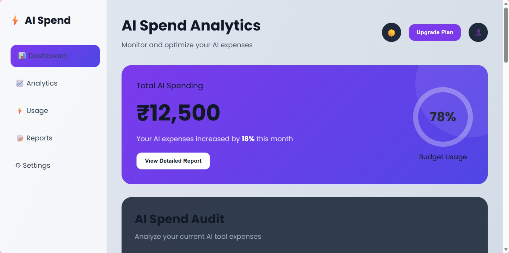
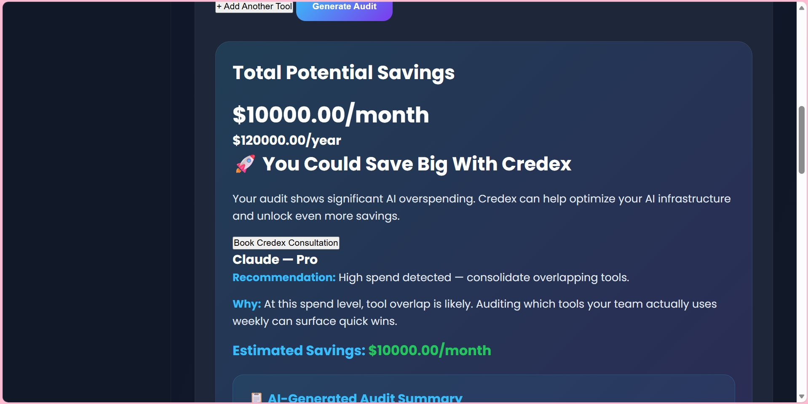

# AI Spend Audit Dashboard

A free web app that audits AI tool spending for startup founders and engineering managers — finds plan mismatches, recommends cheaper alternatives, and calculates total monthly and annual savings.

## Screenshots




## Live Demo

🔗 https://ai-spend-dashboard-5cjo6cs4h-jabinsultanas-projects.vercel.app/

## Who It's For

Startup founders and engineering managers who pay for multiple AI tools (Cursor, Claude, ChatGPT, GitHub Copilot, Gemini, etc.) but have never formally audited whether they're on the right plans for their team size and use case.

## Features

- Multi-tool audit form — supports Cursor, Claude, ChatGPT, GitHub Copilot, Gemini, OpenAI API Direct, Anthropic API Direct, and Windsurf
- Audit engine with defensible per-tool reasoning and savings calculations
- AI-generated personalized summary paragraph based on your stack
- Total monthly and annual savings displayed prominently
- Credex consultation CTA for high-savings cases (>$500/mo)
- Lead capture form with email, company, role, and team size
- Shareable audit report link
- Dark/light mode toggle
- Form state persists across page reloads via localStorage
- Fully responsive design

## Tech Stack

- HTML, CSS, vanilla JavaScript
- Chart.js for analytics visualization
- localStorage for form persistence
- Vercel for deployment

## Quick Start

Clone the repository:

```bash
git clone <your-repo-url>
cd ai-spend-dashboard
```

Open `index.html` using VS Code Live Server or any static web server.

No build step required.

## Deployment

Deployed on Vercel. To deploy your own copy:

1. Push to GitHub
2. Import repo at vercel.com
3. Deploy — no configuration needed for a static site

## Decisions

### 1. Vanilla JavaScript Instead of a Framework

Chose vanilla JS for speed of development and zero build tooling overhead. For a static audit tool with no complex state management needs, a framework would have added setup time without meaningful benefit at this scope.

### 2. Deterministic Audit Logic Instead of AI

The audit engine uses hardcoded rules, not AI generation. Financial recommendations must be explainable, predictable, and testable. AI-generated savings numbers would introduce hallucination risk and make the output undefensible to a finance-literate reviewer.

### 3. localStorage for Persistence

Used localStorage for form state persistence to ship the feature quickly without requiring backend infrastructure. The trade-off is data doesn't survive clearing browser storage, but for an audit tool used once or twice this is acceptable at MVP stage.

### 4. Simplified Shareable URLs

Share links generate a unique ID but don't persist server-side. The trade-off was shipping speed vs full backend implementation. A real Supabase integration would be the first week-2 priority.

### 5. Dashboard-First UI

Prioritized a polished, screenshot-friendly results page because the audit output is the core value — it needs to look credible enough to share internally with a finance team or post on Twitter.

## Developer

Built by Jabin Sultana as part of the Credex Web Development Intern Assignment.
